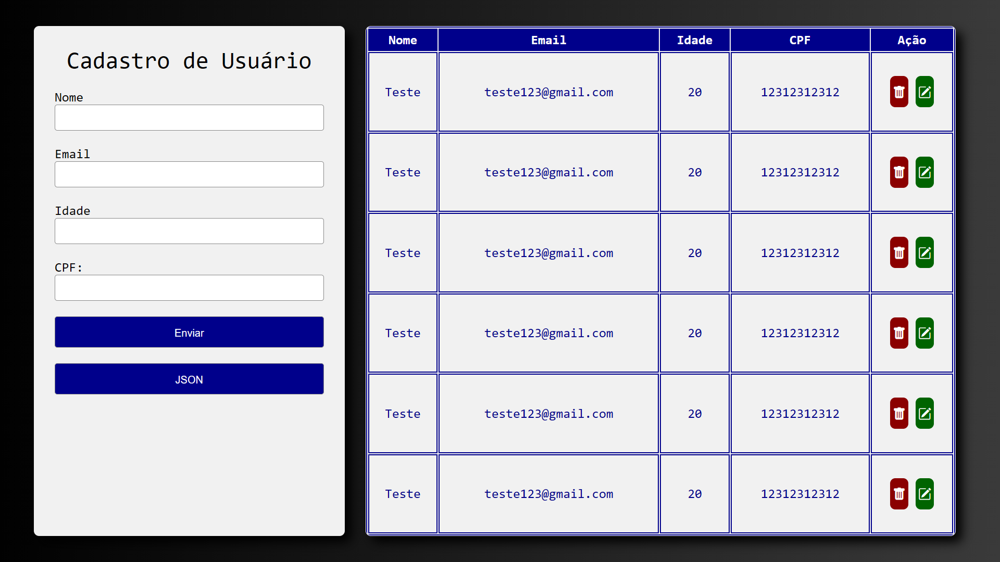

# Cadastro de usuários com python
## 
## Sobre:
Projeto de backend utilizando Python e JavaScript. O sistema realiza o cadastro de usuários e os exibe em uma tabela, permitindo também, excluir e editar informações de cada usuário. Todos os dados são armazenados em um JSON, contendo a lista de usuários.
## Tecnologias utilizadas:

- Html
- CSS
- JavaScript
- Python
## Funções:
- Cadastrar
- Listar
- Editar
- Excluir